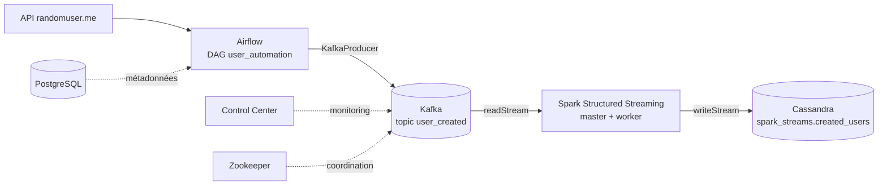

# Pipeline de Data Engineering en temps réel

Pipeline de streaming de bout en bout : des données utilisateurs sont récupérées depuis une API publique, orchestrées par **Airflow**, transportées par **Kafka**, traitées par **Spark Structured Streaming** et stockées dans **Cassandra**. Tout l'environnement est conteneurisé avec **Docker Compose** et démarre avec une seule commande.

> Projet personnel réalisé pour approfondir les concepts de data engineering temps réel, d'après le tutoriel de CodeWithYu, avec de nombreuses adaptations (versions récentes, init automatique, dépannage).

---

## Architecture



**Flux de données :**

1. Un DAG Airflow appelle l'API `randomuser.me` environ une fois par seconde pendant 1 minute et formate chaque utilisateur en JSON.
2. Chaque message est publié dans le topic Kafka `user_created`.
3. Un job Spark Structured Streaming lit le topic en continu, applique un schéma (`from_json`) et écrit chaque micro-batch dans Cassandra.
4. Les données sont consultables via `cqlsh`.

## Stack technique

| Composant | Version | Rôle |
|---|---|---|
| Apache Airflow | 2.10.4 (Python 3.11) | Orchestration et production des messages |
| PostgreSQL | 15 | Base de métadonnées d'Airflow |
| Apache Kafka (Confluent) | 7.4.0 | Bus de messages |
| Zookeeper | 7.4.0 | Coordination du broker Kafka |
| Schema Registry / Control Center | 7.4.0 | Gestion des schémas et monitoring de Kafka |
| Apache Spark | 3.5.3 | Traitement streaming (cluster master + worker) |
| Apache Cassandra | 4.1 | Base NoSQL de destination |
| Docker Compose | - | Orchestration de l'infrastructure |

## Structure du projet

```
.
├── dags/
│   └── kafka_stream.py        # DAG Airflow (API -> Kafka)
├── script/
│   └── entrypoint.sh          # Initialisation d'Airflow (migration DB, utilisateur admin)
├── spark_stream.py            # Job Spark (Kafka -> Cassandra)
├── Dockerfile.spark           # Image Spark + cassandra-driver
├── docker-compose.yml         # Tous les services
├── requirements.txt           # Dépendances Python d'Airflow (kafka-python)
└── README.md
```

## Prérequis

- Docker Desktop (avec WSL2 sous Windows)
- Environ 6 Go de RAM disponibles pour Docker
- Ports libres : 8080, 9021, 9042, 9090, 7077, 9092

## Démarrage rapide

### 1. Lancer l'infrastructure

```bash
docker compose up -d --build
```

Le premier démarrage est long (téléchargement et build des images). Un service `kafka-init` crée automatiquement le topic `user_created` puis s'arrête.

Vérification :

```bash
docker compose ps
docker compose exec broker kafka-topics --bootstrap-server broker:29092 --list
```

### 2. Produire des données avec Airflow

1. Ouvrir http://localhost:8080 (identifiants : `admin` / `admin`)
2. Activer le DAG `user_automation` puis cliquer sur **Trigger DAG**
3. Après environ 1 minute, vérifier les messages dans Kafka :

```bash
docker compose exec broker kafka-run-class kafka.tools.GetOffsetShell --broker-list broker:29092 --topic user_created
```

### 3. Lancer le job Spark

```bash
docker compose exec spark-master /opt/spark/bin/spark-submit \
  --master spark://spark-master:7077 \
  --conf spark.jars.ivy=/tmp/.ivy2 \
  --conf spark.driver.host=spark-master \
  --packages com.datastax.spark:spark-cassandra-connector_2.12:3.5.1,org.apache.spark:spark-sql-kafka-0-10_2.12:3.5.3 \
  /opt/spark_stream.py
```

Le job est un flux continu : le terminal reste occupé tant qu'il tourne. Le keyspace `spark_streams` et la table `created_users` sont créés automatiquement par le script.

### 4. Vérifier les données dans Cassandra

```bash
docker compose exec cassandra cqlsh -e "SELECT first_name, last_name, email FROM spark_streams.created_users LIMIT 5;"
docker compose exec cassandra cqlsh -e "SELECT COUNT(*) FROM spark_streams.created_users;"
```

Pour voir le temps réel : relancer le DAG pendant que Spark tourne et répéter le `COUNT(*)`, le nombre augmente.

## Interfaces web

| Service | URL |
|---|---|
| Airflow | http://localhost:8080 |
| Kafka Control Center | http://localhost:9021 |
| Spark Master | http://localhost:9090 |
| Spark UI (job en cours) | http://localhost:4040 |

## Modèle de données

Table Cassandra `spark_streams.created_users` :

| Colonne | Type | Remarque |
|---|---|---|
| id | UUID | Clé primaire |
| first_name, last_name | TEXT | |
| gender | TEXT | |
| address | TEXT | Adresse concaténée |
| postcode | TEXT | Texte car les codes postaux varient selon les pays |
| email, username, phone | TEXT | |
| dob, registered_date | TEXT | Dates ISO conservées en texte |
| picture | TEXT | URL |

## Choix techniques

- **Tout dans Docker** : Airflow ne tourne pas nativement sous Windows et PySpark nécessite `winutils`. Conteneuriser évite ces problèmes et rend le projet reproductible sur toute machine.
- **Noms de services et non `localhost`** : dans le réseau Docker, les conteneurs se joignent par leur nom (`broker:29092`, `cassandra`).
- **Service `kafka-init`** : le topic est créé de façon déclarative et idempotente (`--if-not-exists`) avant le démarrage de Spark, ce qui évite l'erreur `UnknownTopicOrPartitionException`.
- **Healthchecks et `depends_on`** : garantissent l'ordre de démarrage (Zookeeper, puis broker, puis les services qui en dépendent).
- **Image Spark personnalisée** : `Dockerfile.spark` ajoute `cassandra-driver` pour que le script crée lui-même le keyspace et la table.
- **Checkpoint Spark** : `checkpointLocation` enregistre les offsets Kafka lus, ce qui permet de reprendre après un arrêt sans perte ni doublon.
- **Échec explicite du DAG** : la tâche lève une erreur si aucun message n'a été envoyé, pour éviter un DAG « vert » qui ne fait rien.

## Problèmes rencontrés et solutions

| Problème | Cause | Solution |
|---|---|---|
| `UnknownTopicOrPartitionException` côté Spark | Topic inexistant au démarrage du job | Service `kafka-init` |
| DAG en succès mais topic vide | `import uuid` manquant, erreur avalée par un `try/except` | Import corrigé + compteur de messages envoyés |
| `pip install --user` refusé | Restriction de l'image Airflow | Installation sans `--user` |
| Erreur `HADOOP_HOME` / `winutils` | PySpark lancé sous Windows | `spark-submit` dans le conteneur |
| Image Bitnami Spark restreinte | Changement de distribution | Image officielle `apache/spark` + Dockerfile |

## Commandes utiles

```bash
docker compose up -d --build      # Démarrer
docker compose ps                 # État des services
docker compose logs <service> --tail 40
docker compose down               # Arrêter (ajouter -v pour supprimer les volumes)
```

Après un changement de montage de volumes, faire `docker compose down` puis `up -d`.

## Pistes d'amélioration

- Ajouter des tests unitaires sur `format_data()`
- Passer à plusieurs partitions Kafka et plusieurs workers Spark
- Ajouter une couche de monitoring (Prometheus / Grafana)
- Dédupliquer et valider les données avant l'écriture
- Déployer sur un cloud (Kubernetes, ou services managés Kafka et Cassandra)

## Crédits

Projet inspiré de la vidéo [Realtime Data Streaming | End-to-End Data Engineering Project](https://www.youtube.com/@CodeWithYu) de CodeWithYu, dépôt [airscholar/e2e-data-engineering](https://github.com/airscholar/e2e-data-engineering).

## Auteur

*Ton nom* · [LinkedIn](https://www.linkedin.com/) · [GitHub](https://github.com/)
